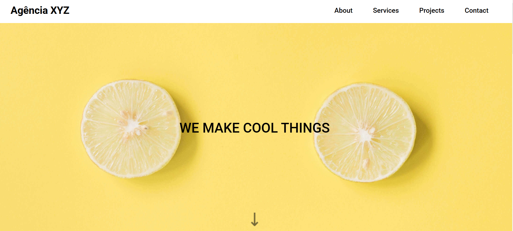

# Projeto de Landing Page


[](https://matvolotao.github.io/landing-page-grid/)


Um projeto de landing page moderno e responsivo, destacando habilidades de desenvolvimento front-end usando apenas HTML e CSS, com foco em tecnicas de flex e grid.

## Visão Geral do Projeto
Este projeto é uma landing page limpa e responsiva, projetada para demonstrar habilidades de front-end. O objetivo é criar sites visualmente atraentes usando tecnologias mínimas, porém eficazes.

## Funcionalidades
- ✅ Design totalmente responsivo.
- 🚀 Interface limpa e moderna.
- 🌐 Compatibilidade entre navegadores.

## Tecnologias Utilizadas
- 📄 **HTML5**
- 🎨 **CSS3**

## Instalação
```bash
git clone <repository-url>
cd <project-directory>
```

## Uso
Basta abrir o arquivo `index.html` em um navegador web para visualizar a landing page. Nenhuma configuração adicional é necessária.

---

## Preview da Página Inicial


## Demonstração em Vídeo


# Contato


[](https://www.linkedin.com/in/matheusvolotao/)

[](mailto:matheus.volotao@hotmail.com)

